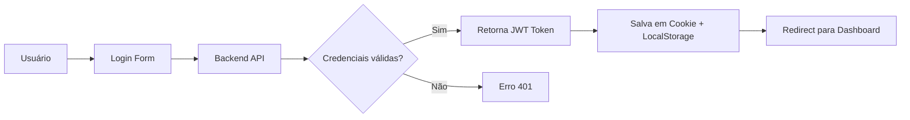

<div align="center">

# 🦽 PCDentro

### Plataforma de Inclusão para Pessoas com Deficiência no Mercado de Trabalho

[](https://nextjs.org/)
[](https://reactjs.org/)
[](https://www.typescriptlang.org/)
[](https://tailwindcss.com/)

[📖 Documentação](../../wiki) • [🚀 Demo](#) • [🐛 Reportar Bug](../../issues) • [💡 Sugerir Feature](../../issues)

</div>

---

## 📋 Índice

- [Sobre o Projeto](#-sobre-o-projeto)
- [Features](#-features)
- [Tecnologias](#-tecnologias)
- [Começando](#-começando)
- [Estrutura do Projeto](#-estrutura-do-projeto)
- [Autenticação](#-autenticação)
- [API](#-api)
- [Roadmap](#-roadmap)
- [Contribuindo](#-contribuindo)
- [Licença](#-licença)

---

## 🎯 Sobre o Projeto

**PCDentro** é uma plataforma web inovadora que conecta **pessoas com deficiência (PcD)** a oportunidades de emprego inclusivas. Nossa missão é promover a acessibilidade e a inclusão no mercado de trabalho, permitindo que empresas encontrem talentos qualificados e que candidatos PcD encontrem vagas adequadas às suas necessidades.

### 🎨 Design Principles

- **🦾 Acessibilidade em Primeiro Lugar**: Interface adaptada para diferentes tipos de deficiência
- **🔐 Segurança**: Autenticação JWT robusta e proteção de dados sensíveis
- **⚡ Performance**: Otimizado com Next.js 15 e Turbopack
- **📱 Responsivo**: Experiência fluida em desktop, tablet e mobile

---

## ✨ Features

### 👤 Para Candidatos PcD

- ✅ **Cadastro Personalizado** com informações sobre tipo de deficiência
- 🔍 **Busca Inteligente de Vagas** filtradas por tipo de acessibilidade
- 📊 **Painel de Candidaturas** para acompanhar aplicações
- 👨‍💼 **Perfil Profissional** editável com currículo e experiências
- 🔔 **Notificações** de novas vagas compatíveis

### 🏢 Para Empresas

- 📝 **Criação de Vagas Inclusivas** com recursos de acessibilidade
- 👥 **Gestão de Candidaturas** recebidas
- 📈 **Dashboard** com estatísticas de vagas
- ⚙️ **Perfil Empresarial** completo
- 🎯 **Match Automático** com candidatos qualificados

### 🔧 Para Administradores

- 📊 **Analytics Completo** da plataforma
- 🏷️ **Gestão de Categorias** (tipos de deficiência, barreiras, acessibilidade)
- 👮 **Moderação de Conteúdo**
- 📋 **Relatórios Detalhados**

---

## 🛠️ Tecnologias

### Frontend

- **[Next.js 15](https://nextjs.org/)** - Framework React com SSR e App Router
- **[React 19](https://reactjs.org/)** - Biblioteca UI
- **[TypeScript](https://www.typescriptlang.org/)** - Tipagem estática
- **[Tailwind CSS 4](https://tailwindcss.com/)** - Estilização utility-first
- **[Turbopack](https://turbo.build/pack)** - Bundler de alta performance

### Autenticação & Segurança

- **JWT (JSON Web Tokens)** - Autenticação stateless
- **HTTP-only Cookies** - Armazenamento seguro de tokens
- **Middleware de Proteção** - Validação de rotas server-side

### Estado & Contexto

- **React Context API** - Gerenciamento de estado global
- **Custom Hooks** - Lógica reutilizável

---

## 🚀 Começando

### Pré-requisitos

- **Node.js** 18+ 
- **npm**, **yarn** ou **pnpm**
- Backend da API rodando em `http://localhost:3001`

### Instalação

1. **Clone o repositório**
```bash
git clone https://github.com/seu-usuario/pcdentro.git
cd pcdentro
```

2. **Instale as dependências**
```bash
npm install
# ou
pnpm install
# ou
yarn install
```

3. **Configure as variáveis de ambiente**
```bash
cp .env.example .env
```

Edite o arquivo `.env`:
```env
NEXT_PUBLIC_API_URL=http://localhost:3001
NEXT_PUBLIC_APP_URL=http://localhost:3000
```

4. **Execute o servidor de desenvolvimento**
```bash
npm run dev
# ou
pnpm dev
```

5. **Abra no navegador**
```
http://localhost:3000
```

### Build para Produção

```bash
npm run build
npm run start
```

---

## 📁 Estrutura do Projeto

```
pcdentro/
├── app/                          # App Router (Next.js 15)
│   ├── page.tsx                  # Landing page
│   ├── layout.tsx                # Layout global
│   ├── globals.css               # Estilos globais
│   ├── login/                    # Páginas de login
│   │   ├── page.tsx              # Login candidato/empresa
│   │   └── admin/                # Login admin
│   ├── cadastro/                 # Cadastro de usuários
│   ├── vaga/                     # Páginas de vagas
│   │   ├── page.tsx              # Listagem de vagas
│   │   └── create/               # Criar vaga
│   ├── minhas-vagas/             # Gestão de vagas (empresa)
│   ├── perfil/                   # Perfil do usuário
│   │   └── editar/               # Editar perfil
│   ├── mudar-senha/              # Alterar senha
│   └── admin/                    # Painel administrativo
│
├── src/
│   ├── contexts/                 # Contextos React
│   │   └── AuthContext.tsx       # Contexto de autenticação
│   ├── hooks/                    # Custom hooks
│   │   └── useRequireAuth.ts     # Hook de proteção de rotas
│   └── lib/
│       ├── jwt.ts                # Utilitários JWT
│       └── api/                  # Funções de API
│           ├── apiClient.ts      # Cliente HTTP base
│           ├── auth/             # Autenticação
│           ├── candidate/        # Candidatos
│           ├── empresa/          # Empresas
│           ├── vaga/             # Vagas
│           └── admin/            # Admin
│
├── public/                       # Assets estáticos
├── middleware.ts                 # Middleware Next.js (proteção de rotas)
├── next.config.ts                # Configuração Next.js
├── tailwind.config.ts            # Configuração Tailwind
└── tsconfig.json                 # Configuração TypeScript
```

---

## 🔐 Autenticação

O PCDentro utiliza **autenticação JWT** com as seguintes características:

### Fluxo de Login



### Tipos de Usuário

| Tipo | Role Backend | Role Frontend | Permissões |
|------|--------------|---------------|------------|
| 👤 Candidato | `candidato` | `candidate` | Ver vagas, candidatar-se, editar perfil |
| 🏢 Empresa | `empresa` | `company` | Criar vagas, ver candidaturas, editar empresa |
| 🔧 Admin | `administrador` | `admin` | Gestão completa da plataforma |

### Exemplo de Uso

```typescript
import { useRequireAuth } from '@/src/hooks/useRequireAuth';

export default function ProtectedPage() {
  // Redireciona para /login se não autenticado
  const { user, token } = useRequireAuth();
  
  // Ou requer role específica
  const { user } = useRequireAuth('/login', 'company');
  
  return <div>Conteúdo protegido</div>;
}
```

📖 **[Ver documentação completa de autenticação →](./MIGRACAO_JWT.md)**

---

## 🌐 API

### Base URL
```
http://localhost:3001
```

### Headers de Autenticação
```typescript
{
  'Authorization': 'Bearer {JWT_TOKEN}',
  'Content-Type': 'application/json'
}
```

### Principais Endpoints

#### Autenticação
- `POST /login/candidato` - Login de candidato
- `POST /login/empresa` - Login de empresa
- `POST /login/admin` - Login de administrador

#### Vagas
- `GET /get/vagas` - Listar todas as vagas
- `GET /get/vagas/byId/{companyId}` - Vagas por empresa
- `GET /get/vagas/byCandidato/{candidateId}` - Candidaturas do candidato
- `POST /create/vaga` - Criar nova vaga
- `DELETE /delete/vaga/{vagaId}` - Deletar vaga

#### Candidatos
- `POST /create/candidato` - Criar candidato
- `PUT /update/candidato/{id}` - Atualizar candidato
- `POST /apply/vaga` - Candidatar-se a vaga

#### Empresas
- `POST /create/empresa` - Criar empresa
- `PUT /update/empresa/{id}` - Atualizar empresa

### Exemplo de Requisição

```typescript
import { getAuthHeaders } from '@/src/lib/api/apiClient';

const response = await fetch('http://localhost:3001/get/vagas', {
  method: 'GET',
  headers: getAuthHeaders(),
});

const data = await response.json();
```

📖 **[Ver exemplos completos de API →](./EXEMPLOS_JWT.md)**

---

## 🗺️ Roadmap

### ✅ Concluído

- [x] Sistema de autenticação JWT
- [x] CRUD de vagas
- [x] Sistema de candidaturas
- [x] Filtro de vagas por tipo de deficiência
- [x] Painel administrativo
- [x] Perfil editável

### 🚧 Em Desenvolvimento

- [ ] Sistema de notificações em tempo real
- [ ] Chat entre empresa e candidato
- [ ] Upload de currículo em PDF
- [ ] Testes automatizados
- [ ] Internacionalização (i18n)

### 📅 Planejado

- [ ] Aplicativo mobile (React Native)
- [ ] Integração com LinkedIn
- [ ] Sistema de recomendações com IA
- [ ] Dashboard de analytics avançado
- [ ] API pública para integrações

---

## 🤝 Contribuindo

Contribuições são **muito bem-vindas**! Veja como você pode ajudar:

1. **Fork** o projeto
2. **Crie uma branch** para sua feature (`git checkout -b feature/AmazingFeature`)
3. **Commit** suas mudanças (`git commit -m 'Add some AmazingFeature'`)
4. **Push** para a branch (`git push origin feature/AmazingFeature`)
5. **Abra um Pull Request**

### Diretrizes

- ✅ Siga o padrão de código TypeScript
- ✅ Adicione testes quando aplicável
- ✅ Atualize a documentação
- ✅ Mantenha commits semânticos

---

## 📄 Licença

Este projeto está sob a licença MIT. Veja o arquivo [LICENSE](LICENSE) para mais detalhes.

---

## 👨‍💻 Autor

Desenvolvido com 💙 por **Diego Melo**

- GitHub: [@seu-usuario](https://github.com/seu-usuario)
- LinkedIn: [Seu Nome](https://linkedin.com/in/seu-perfil)

---

## 🙏 Agradecimentos

- Comunidade Next.js
- Comunidade React
- Todos os contribuidores do projeto
- Organizações que apoiam a inclusão de PcD

---

<div align="center">

**⭐ Se este projeto te ajudou, considere dar uma estrela!**

[⬆ Voltar ao topo](#-pcdentro)

</div>
