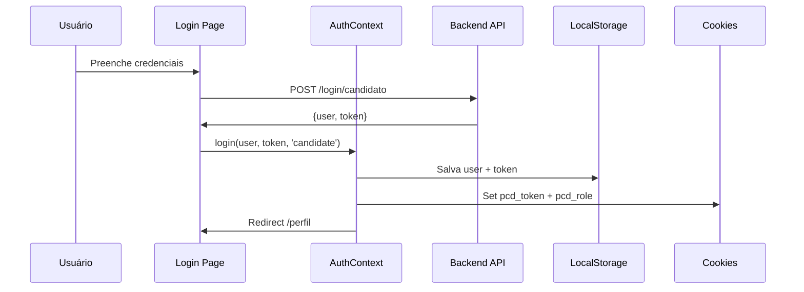
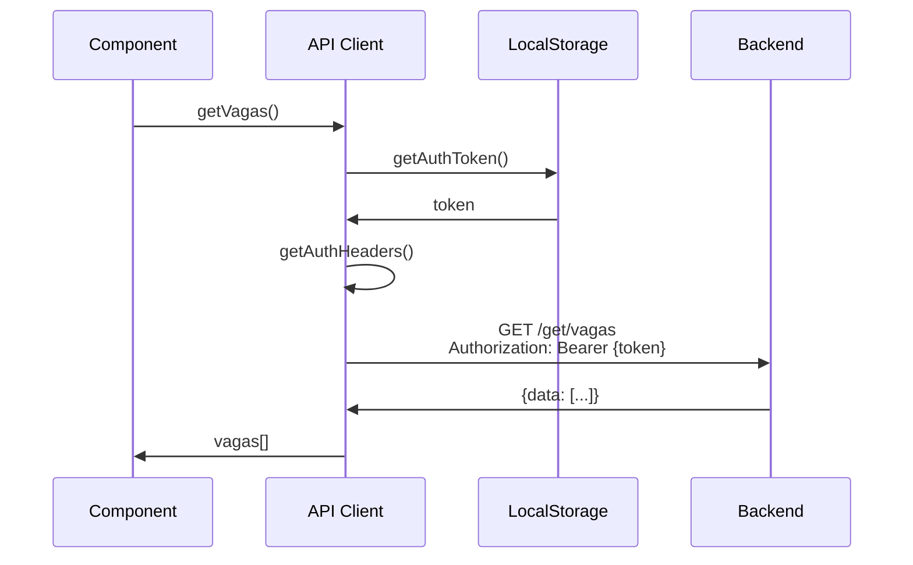
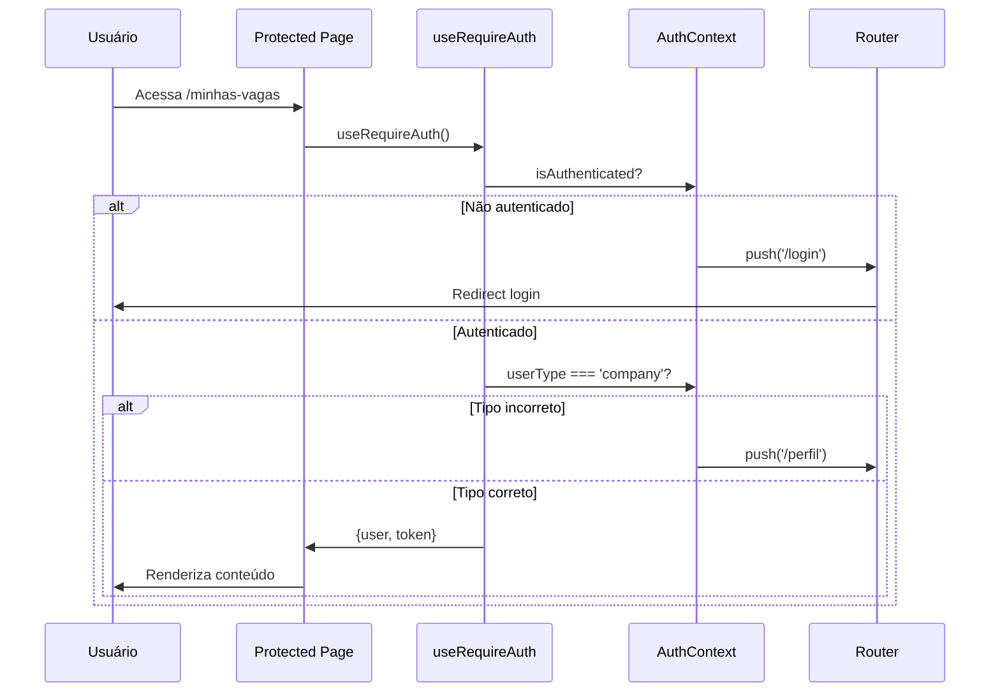
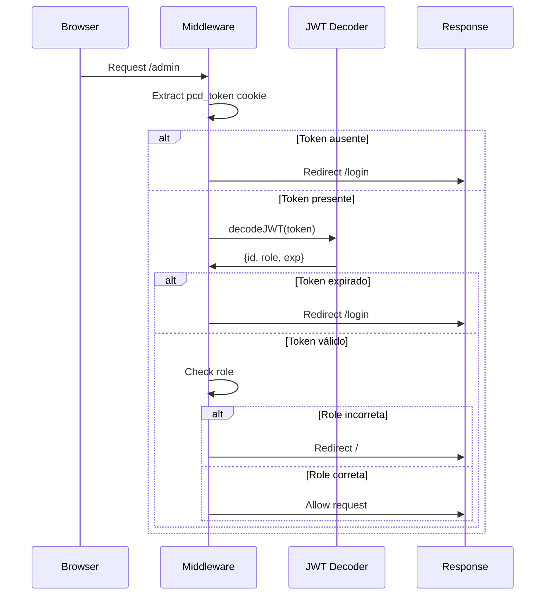

# 🏗️ Arquitetura do Projeto

Esta página documenta a arquitetura e estrutura do **PCDentro**, explicando como os diferentes componentes se conectam.

## 📐 Arquitetura Geral

```
┌─────────────────────────────────────────────────────────┐
│                     FRONTEND (Next.js)                  │
│  ┌──────────────┐  ┌──────────────┐  ┌──────────────┐ │
│  │   App Router │  │  Components  │  │   Context    │ │
│  │  (pages)     │  │    (UI)      │  │   (State)    │ │
│  └──────┬───────┘  └──────┬───────┘  └──────┬───────┘ │
│         │                 │                  │          │
│         └─────────────────┴──────────────────┘          │
│                           │                             │
│                    ┌──────▼───────┐                     │
│                    │  API Client  │                     │
│                    │   (fetch)    │                     │
│                    └──────┬───────┘                     │
└───────────────────────────┼─────────────────────────────┘
                            │ HTTP + JWT
                            │
┌───────────────────────────▼─────────────────────────────┐
│                    BACKEND (API)                        │
│  ┌──────────────┐  ┌──────────────┐  ┌──────────────┐ │
│  │   Routes     │  │ Controllers  │  │   Database   │ │
│  │  (Express)   │  │   (Logic)    │  │ (PostgreSQL) │ │
│  └──────────────┘  └──────────────┘  └──────────────┘ │
└─────────────────────────────────────────────────────────┘
```

---

## 📁 Estrutura de Pastas Detalhada

### `/app` - App Router (Next.js 15)

```
app/
├── layout.tsx                 # Layout raiz da aplicação
├── page.tsx                   # Landing page (/)
├── globals.css                # Estilos globais
│
├── login/                     # Rotas de autenticação
│   ├── page.tsx               # Login candidato/empresa (/login)
│   └── admin/
│       └── page.tsx           # Login admin (/login/admin)
│
├── cadastro/
│   └── page.tsx               # Cadastro de usuários (/cadastro)
│
├── vaga/
│   ├── page.tsx               # Listagem de vagas (/vaga)
│   └── create/
│       └── page.tsx           # Criar vaga (/vaga/create)
│
├── minhas-vagas/
│   └── page.tsx               # Vagas da empresa (/minhas-vagas)
│
├── perfil/
│   ├── page.tsx               # Ver perfil (/perfil)
│   └── editar/
│       └── page.tsx           # Editar perfil (/perfil/editar)
│
├── mudar-senha/
│   └── page.tsx               # Alterar senha (/mudar-senha)
│
└── admin/
    └── page.tsx               # Painel admin (/admin)
```

**Convenções:**
- Cada pasta com `page.tsx` é uma rota
- `layout.tsx` define o layout compartilhado
- Roteamento é baseado em sistema de arquivos

---

### `/src` - Lógica de Negócio

```
src/
├── contexts/
│   └── AuthContext.tsx        # Contexto de autenticação global
│
├── hooks/
│   └── useRequireAuth.ts      # Hook de proteção de rotas
│
└── lib/
    ├── jwt.ts                 # Utilitários JWT
    │
    └── api/
        ├── apiClient.ts       # Cliente HTTP base
        │
        ├── auth/              # Endpoints de autenticação
        │   ├── loginCandidate.ts
        │   ├── loginCompany.ts
        │   ├── loginAdmin.ts
        │   └── changePassword.ts
        │
        ├── candidate/         # Endpoints de candidatos
        │   ├── postCandidate.ts
        │   ├── updateCandidate.ts
        │   ├── getCandidate.ts
        │   └── getCandidateByEmail.ts
        │
        ├── empresa/           # Endpoints de empresas
        │   ├── postCompany.ts
        │   ├── updateCompany.ts
        │   ├── getCompany.ts
        │   └── getCompanyByEmail.ts
        │
        ├── vaga/              # Endpoints de vagas
        │   ├── createVaga.ts
        │   ├── getVagas.ts
        │   ├── getVagaById.ts
        │   ├── getVagasByCompany.ts
        │   ├── getVagasByCandidate.ts
        │   ├── applyVaga.ts
        │   └── deleteVaga.ts
        │
        └── admin/             # Endpoints administrativos
            ├── getAnalitycs.ts
            ├── createAcessibilidade.ts
            ├── createBarreira.ts
            └── createSubTipo.ts
```

---

## 🔄 Fluxo de Dados

### 1. Autenticação



### 2. Requisição Autenticada



### 3. Proteção de Rota (Client-Side)



### 4. Middleware (Server-Side)



---

## 🧩 Componentes Principais

### AuthContext

**Localização**: `src/contexts/AuthContext.tsx`

**Responsabilidades**:
- Gerenciar estado de autenticação global
- Armazenar informações do usuário
- Prover funções de login/logout
- Persistir dados em localStorage e cookies

**Estado**:
```typescript
{
  user: User | null,
  token: string | null,
  userType: 'candidate' | 'company' | 'admin' | null,
  isAuthenticated: boolean,
  isLoading: boolean
}
```

**Métodos**:
- `login(user, token, userType)` - Fazer login
- `logout()` - Fazer logout
- `updateUser(newData)` - Atualizar dados do usuário

---

### useRequireAuth Hook

**Localização**: `src/hooks/useRequireAuth.ts`

**Propósito**: Proteger rotas client-side

**Uso**:
```typescript
const { user, token } = useRequireAuth('/login', 'company');
```

**Validações**:
1. ✅ Verifica se está autenticado
2. ✅ Verifica se o token não expirou
3. ✅ Verifica se o tipo de usuário está correto
4. ✅ Redireciona se alguma validação falhar

---

### API Client

**Localização**: `src/lib/api/apiClient.ts`

**Funções**:

#### `getAuthToken()`
Recupera o token JWT do localStorage.

#### `getAuthHeaders()`
Retorna headers HTTP com autenticação:
```typescript
{
  'Content-Type': 'application/json',
  'Authorization': 'Bearer {token}'
}
```

#### `authenticatedFetch(url, options)`
Wrapper para `fetch` que adiciona autenticação automaticamente.

---

### Middleware

**Localização**: `middleware.ts`

**Função**: Proteção server-side de rotas

**Fluxo**:
1. Extrai cookie `pcd_token`
2. Decodifica JWT
3. Valida expiração
4. Verifica role do usuário
5. Permite ou redireciona

**Rotas Protegidas**:
- `/admin/*` → Apenas `administrador`
- `/minhas-vagas` → Apenas `empresa`
- `/perfil/*` → Usuários autenticados

---

## 🎨 Padrões de Design

### 1. Container/Presenter Pattern

**Páginas** (containers) gerenciam estado e lógica:
```typescript
export default function VagasPage() {
  const [vagas, setVagas] = useState([]);
  const loadVagas = async () => { /* ... */ };
  
  return <VagasList vagas={vagas} />;
}
```

**Componentes** (presenters) apenas renderizam:
```typescript
function VagasList({ vagas }) {
  return vagas.map(vaga => <VagaCard key={vaga.id} {...vaga} />);
}
```

### 2. Custom Hooks

Lógica reutilizável extraída em hooks:
```typescript
// Antes
useEffect(() => {
  if (!isAuthenticated) router.push('/login');
}, [isAuthenticated]);

// Depois
const { user } = useRequireAuth();
```

### 3. API Layer

Todas as chamadas HTTP isoladas em `src/lib/api/`:
```typescript
// ❌ Não fazer
fetch('http://localhost:3001/get/vagas');

// ✅ Fazer
import { getVagas } from '@/src/lib/api/vaga/getVagas';
const vagas = await getVagas();
```

### 4. Error Boundaries

Tratamento de erros em camadas:
- **Component**: Try/catch local
- **API**: Throw erros específicos
- **Global**: Error boundary (futuro)

---

## 🔐 Segurança

### Camadas de Proteção

1. **Client-side** (useRequireAuth)
   - Validação imediata
   - Melhor UX
   - Pode ser bypassada (não é segurança real)

2. **Server-side** (Middleware)
   - Validação no servidor
   - Segurança real
   - Protege rotas antes de renderizar

3. **Backend** (API)
   - Validação final
   - Autorização por endpoint
   - Última linha de defesa

### Fluxo de Token

```
Login → Backend retorna JWT → Frontend armazena
              ↓
    Cookies (pcd_token)      # Usado pelo middleware
    LocalStorage (token)     # Usado por requests API
```

---

## 📊 Gerenciamento de Estado

### Estado Global (AuthContext)
- Informações do usuário
- Token de autenticação
- Tipo de usuário

### Estado Local (useState)
- Formulários
- Listagens de vagas
- Modais e UI temporária

### Estado de Servidor (Future: React Query)
- Cache de requisições
- Sincronização automática
- Invalidação inteligente

---

## 🚀 Performance

### Server Components

Next.js 15 usa React Server Components por padrão:
- Renderização no servidor
- Bundle menor
- Melhor SEO

### Code Splitting

Automático por rota:
```
/login → login.js (100kb)
/vaga → vaga.js (150kb)
/admin → admin.js (200kb)
```

### Turbopack

Build ultra-rápido:
- 700x mais rápido que Webpack
- Hot reload instantâneo

---

## 🔄 Ciclo de Vida de uma Requisição

```
1. Usuário clica em "Ver Vagas"
   ↓
2. Page component carrega (SSR)
   ↓
3. useEffect chama loadVagas()
   ↓
4. getVagas() → getAuthHeaders()
   ↓
5. fetch com Authorization header
   ↓
6. Backend valida JWT
   ↓
7. Backend retorna vagas
   ↓
8. Frontend filtra por deficiência
   ↓
9. setState atualiza UI
   ↓
10. React re-renderiza
```

---

## 📚 Próximos Passos

- **[Sistema de Vagas](./Vagas.md)** - Como funciona o filtro de vagas
- **[Autenticação](./Autenticacao.md)** - Detalhes do sistema de auth
- **[API](./API.md)** - Documentação completa da API

---

[⬅️ Voltar: Instalação](./Instalacao.md) | [➡️ Próximo: Autenticação](./Autenticacao.md)
