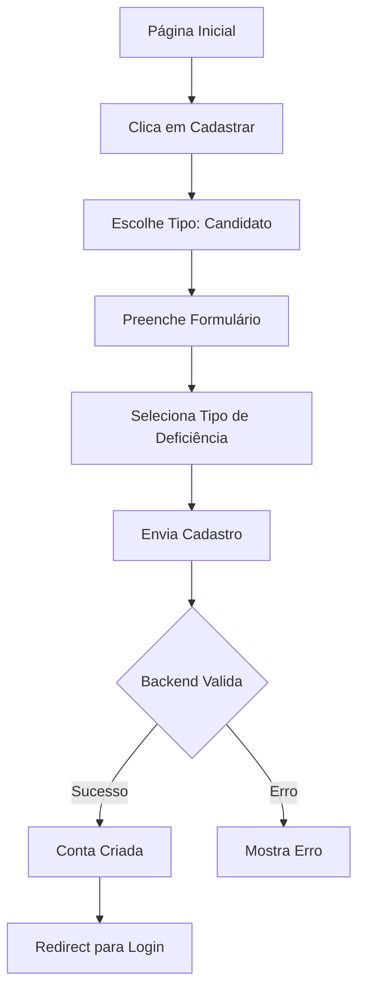
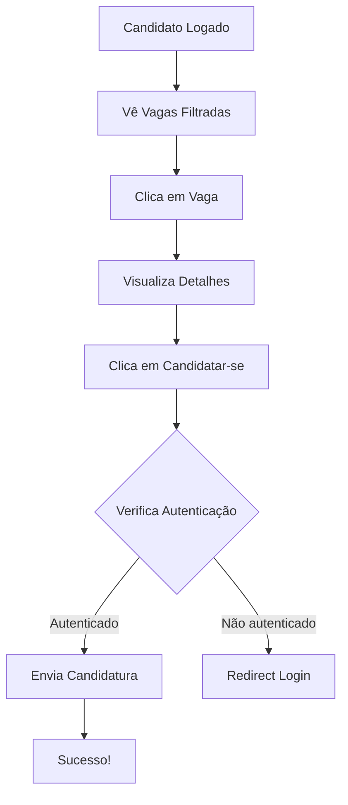
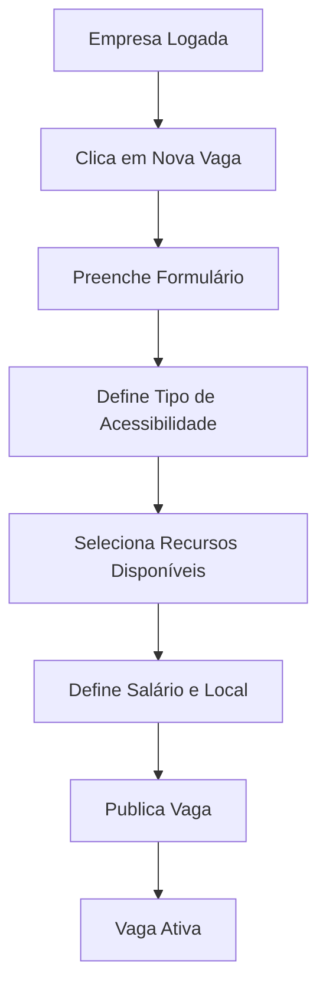

# 📖 Introdução ao PCDentro

## O que é o PCDentro?

**PCDentro** é uma plataforma web que revoluciona a forma como pessoas com deficiência (PcD) encontram oportunidades no mercado de trabalho. Nossa missão é promover a **inclusão** e a **acessibilidade**, conectando talentos qualificados a empresas comprometidas com a diversidade.

## 🎯 Visão Geral

### Problema que Resolvemos

No Brasil, pessoas com deficiência enfrentam barreiras significativas no mercado de trabalho:
- 🚫 Dificuldade em encontrar vagas adaptadas
- 📊 Falta de transparência sobre acessibilidade
- 🔍 Plataformas de emprego não filtram por tipo de deficiência
- 💼 Empresas não sabem como alcançar candidatos PcD

### Nossa Solução

PCDentro oferece:
- ✅ **Filtro Inteligente**: Vagas são filtradas automaticamente pelo tipo de deficiência do candidato
- ✅ **Transparência**: Empresas declaram recursos de acessibilidade disponíveis
- ✅ **Match Personalizado**: Candidatos veem apenas vagas compatíveis com suas necessidades
- ✅ **Inclusão Real**: Processo simplificado para candidaturas

---

## 👥 Personas

### 1. 👤 Candidato PcD

**Quem é**: Pessoa com deficiência buscando emprego

**Pode fazer**:
- Criar perfil com informações sobre sua deficiência
- Buscar vagas filtradas por acessibilidade
- Candidatar-se a vagas compatíveis
- Acompanhar status de candidaturas
- Editar currículo e informações

**Exemplo de Jornada**:
```
Cadastro → Define tipo de deficiência → Vê vagas compatíveis → Candidata-se → Acompanha
```

---

### 2. 🏢 Empresa

**Quem é**: Organização comprometida com inclusão

**Pode fazer**:
- Criar vagas inclusivas
- Declarar recursos de acessibilidade disponíveis
- Definir tipos de deficiência aceitos
- Ver candidaturas recebidas
- Gerenciar vagas ativas

**Exemplo de Jornada**:
```
Cadastro → Cria vaga → Define acessibilidade → Recebe candidaturas → Seleciona candidatos
```

---

### 3. 🔧 Administrador

**Quem é**: Gestor da plataforma

**Pode fazer**:
- Ver analytics da plataforma
- Gerenciar categorias (tipos de deficiência, barreiras, recursos de acessibilidade)
- Moderar conteúdo
- Gerar relatórios

---

## 🎨 Conceitos-Chave

### Tipos de Deficiência

O sistema trabalha com prefixos para categorizar deficiências:

| Prefixo | Tipo | Exemplo |
|---------|------|---------|
| `DMOTO` | Deficiência Motora | DMOTO-305079 |
| `DVISU` | Deficiência Visual | DVISU-0001 |
| `DAUDI` | Deficiência Auditiva | DAUDI-123456 |
| `DINTE` | Deficiência Intelectual | DINTE-789012 |

### Filtro Inteligente

Quando um candidato com deficiência `DVISU-0001` acessa a plataforma:
1. O sistema extrai o prefixo: `DVISU`
2. Filtra vagas que aceitam `DVISU`
3. Mostra apenas vagas compatíveis

Isso garante que o candidato veja apenas oportunidades realmente acessíveis.

### Recursos de Acessibilidade

Empresas podem declarar recursos como:
- ♿ Rampa com inclinação adequada
- 🚪 Elevador / acesso em nível
- 👓 Sinalização de alto contraste
- 🤟 Intérprete de Libras
- 💬 Comunicação por chat interno
- 🦮 Piso guia / sinalização tátil

---

## 🔧 Tecnologias Utilizadas

### Frontend
- **Next.js 15**: Framework React com SSR e App Router
- **React 19**: Biblioteca de UI
- **TypeScript**: Tipagem estática para código mais seguro
- **Tailwind CSS 4**: Estilização moderna e responsiva

### Autenticação
- **JWT**: Tokens seguros para autenticação
- **HTTP-only Cookies**: Armazenamento seguro de tokens
- **Role-based Access**: Controle de acesso por tipo de usuário

### Performance
- **Turbopack**: Build ultra-rápido
- **Server Components**: Renderização otimizada
- **Code Splitting**: Carregamento sob demanda

---

## 📊 Fluxos Principais

### Fluxo de Cadastro (Candidato)



### Fluxo de Candidatura



### Fluxo de Criação de Vaga (Empresa)



---

## 🎯 Próximos Passos

Agora que você entende o básico do PCDentro, explore:

1. **[Guia de Instalação](./Instalacao.md)** - Configure o projeto localmente
2. **[Arquitetura](./Arquitetura.md)** - Entenda a estrutura do código
3. **[Autenticação](./Autenticacao.md)** - Aprenda como funciona o sistema de login
4. **[API](./API.md)** - Veja todos os endpoints disponíveis

---

## 🤔 Dúvidas Frequentes

**P: Preciso de um backend para rodar o projeto?**
R: Sim, o frontend se comunica com uma API backend em `http://localhost:3001`. Veja o [Guia de Instalação](./Instalacao.md).

**P: Posso contribuir com o projeto?**
R: Com certeza! Veja o [Guia de Contribuição](./Contribuindo.md).

**P: Como reporto bugs?**
R: Abra uma [issue no GitHub](../../issues) com detalhes do problema.

---

[⬅️ Voltar para Home](./Home.md) | [➡️ Próximo: Instalação](./Instalacao.md)
